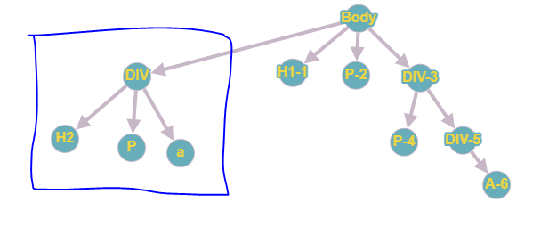

# Fatores de qualidade ISO-9126

## Funcionalidade

> Busca de artigo conforme critério de busca: E-mail, título, descrição.

## Confiabilidade

> Capacidade de tratamento de erros em caso de ausência de artigos para critérios de busca.

## Usabilidade

> Capacidade do sistema de se adequar à proporções distintas de tamanho de tela/interface e proporções de conteúdo textual.

Observamos aqui que além das necessidades do sistema de se adequar à diferentes proporções de tela, vale aqui ainda enfatizar que características visuais, tais como paginação, têm efeito de melhor compreensão da interface.

## Eficiência

> Redução do tempo de busca de dados, por parte do servidor, e redução do tempo de espera, por parte do usuário, quanto à divisão de elementos de pesquisa em páginas.

## Facilidade de manutenção

### Estrutura de projeto baseada em componentes

Utilização de componentes para divisão de funcionalidades/partes do sistema, contribuindo para melhor manutenção e atualização de recursos à longo prazo.

> Definimos por componente uma parte que compõe o software.

## Portabilidade

> Utilizando uma plataforma de _deploy_, a cada alteração realizada, será refletida no software em ambiente de produção.
